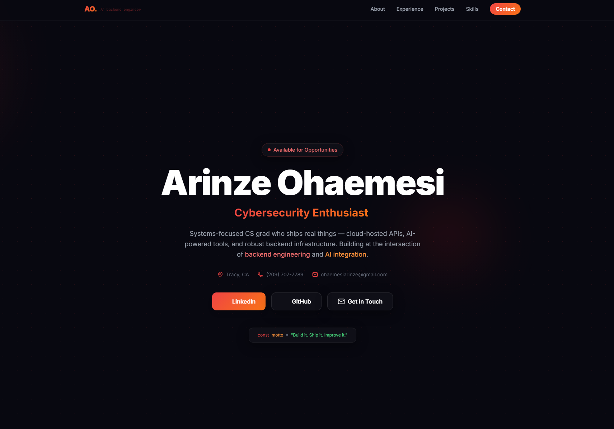
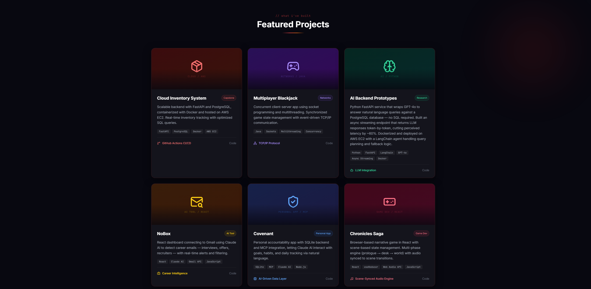

# Arinze Ohaemesi — Portfolio

Personal portfolio website for **Arinze Ohaemesi**, Backend Engineer & Systems Developer. Built with vanilla HTML, Tailwind CSS, and JavaScript — no frameworks, no build step, just fast.

🔗 **Live Site:** [arinze-ohaemesi.vercel.app](https://arinze-ohaemesi.vercel.app)

---

## Screenshots

### Hero Section


### Projects


### Skills


### Contact


---

## Features

- **Red Glassmorphism UI** — deep dark background with heavy frosted glass cards, red glow hover effects, and gradient light orbs
- **Typing Animation** — hero cycles through roles: Backend Engineer, Systems Developer, AI Tinkerer, Builder, API Architect
- **6 Featured Projects** — including Cloud Inventory System, Multiplayer Blackjack, NoBox, Covenant, Chronicles Saga, and AI Backend Prototypes
- **Role Tab Switcher** — toggle between Junior SWE and Data Analyst experience at Tri Valley Care
- **Easter Egg** — type the Konami code (↑↑↓↓←→←→BA) or click the logo 5×
- **Fully Responsive** — mobile menu, fluid grid layouts, works on all screen sizes
- **JetBrains Mono accents** — code-style labels and monospace typography throughout

---

## Tech Stack

| Layer | Technology |
|-------|-----------|
| Markup | HTML5 |
| Styling | Tailwind CSS (CDN) |
| Icons | Lucide Icons |
| Fonts | Inter + JetBrains Mono (Google Fonts) |
| Scripting | Vanilla JavaScript |
| Hosting | Vercel |

---

## Project Structure

```
arinze-portfolio/
├── index.html        # Entire site — single file
├── screenshots/      # Add screenshots here
│   ├── hero.png
│   ├── projects.png
│   ├── skills.png
│   └── contact.png
└── README.md
```

---

## Running Locally

No install needed — just open the file:

```bash
# Clone the repo
git clone https://github.com/Arinzayyy/arinze-portfolio.git
cd arinze-portfolio

# Open in browser
open index.html       # macOS
start index.html      # Windows
```

---

## Deploying

The site auto-deploys to Vercel on every push to `main`. To deploy manually:

```bash
git add .
git commit -m "your message"
git push origin main
```

---

## Contact

**Arinze Ohaemesi**
- 📧 [ohaemesiarinze@gmail.com](mailto:ohaemesiarinze@gmail.com)
- 📞 (209) 707-7789
- 💼 [LinkedIn](https://www.linkedin.com/in/arinze-ohaemesi-1667a426b/)
- 🐙 [GitHub](https://github.com/Arinzayyy)

---

© 2025 Arinze Ohaemesi
