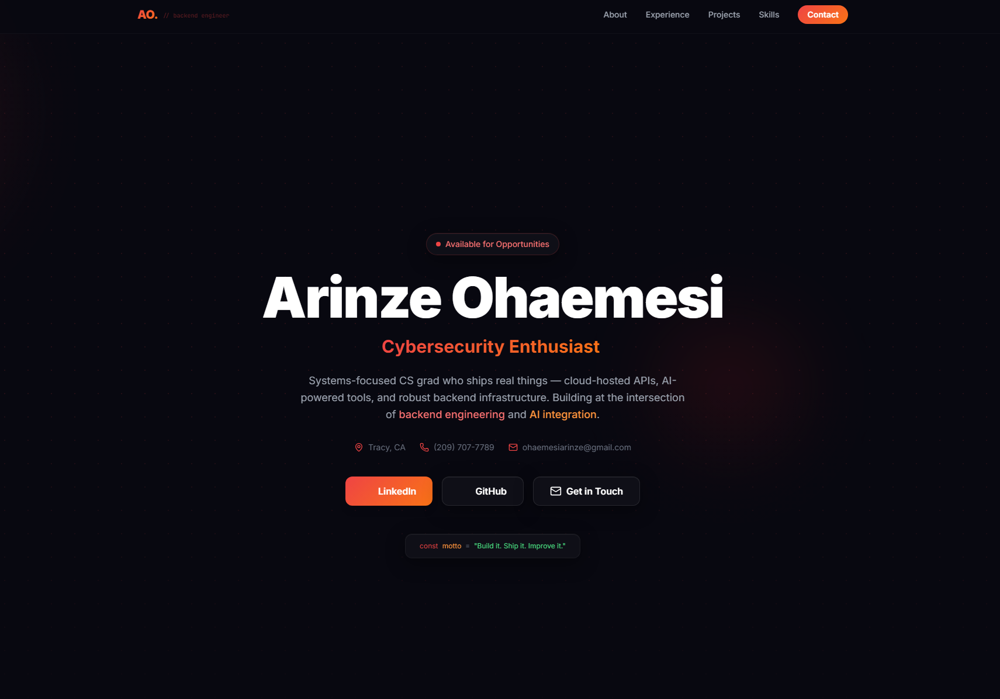
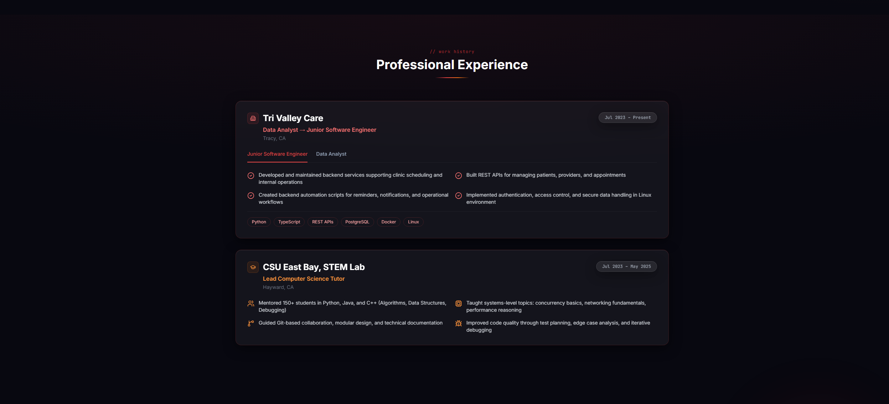
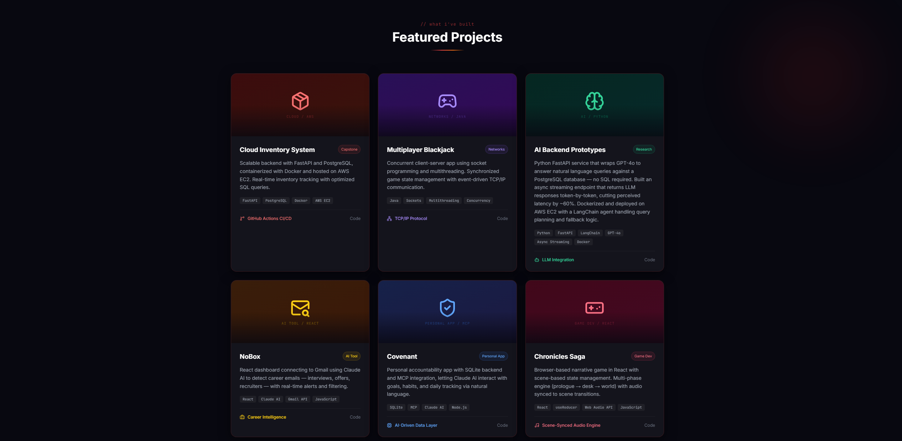
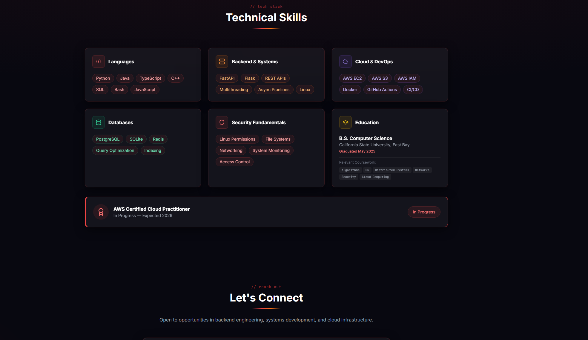

# Arinze Ohaemesi — Portfolio

Personal portfolio website for **Arinze Ohaemesi**, Backend Engineer & Systems Developer. Built with vanilla HTML, Tailwind CSS, and JavaScript — no frameworks, no build step, just fast.

🔗 **Live Site:** [arinze-ohaemesi.vercel.app](https://arinze-ohaemesi.vercel.app)

---

## Screenshots

### Hero


### Experience


### Projects


### Projects (cont.)


---

## Features

- **Red Glassmorphism UI** — deep dark background with frosted glass cards, red glow hover effects, and gradient light orbs
- **Persona Mode** — a full Persona 5–styled alternate portfolio: skewed parallelogram menus, GSAP screen wipes, synthesized WebAudio button sounds (with a persistent mute toggle), star-burst effects, and six themed sub-pages
- **6 Featured Projects** — Cloud Inventory System (capstone), Multiplayer Blackjack, AI Backend Prototypes, NoBox, Covenant, and Chronicles Saga
- **2 Technical Case Studies** — deep dives on Chronicles Saga (branching narrative engine) and the Cloud Inventory System (caching, async pipelines, CI/CD)
- **Experience Timeline** — date-pill timeline covering Tri Valley Urgent Care (Data Analyst → Junior SWE) and CSU East Bay
- **Typing Animation** — hero cycles through roles: Backend Engineer, Systems Developer, AI Tinkerer, Builder, API Architect
- **Easter Egg** — type the Konami code (↑↑↓↓←→←→BA) or click the logo 5×
- **Fully Responsive** — mobile menu, fluid grid layouts, scroll progress bar, active-section nav highlighting, reduced-motion support
- **SEO-ready** — meta description, Open Graph + Twitter cards, favicon

---

## Tech Stack

| Layer | Technology |
|-------|-----------|
| Markup | HTML5 |
| Styling | Tailwind CSS (CDN) |
| Animation | GSAP (Persona Mode), CSS keyframes |
| Audio | WebAudio API (synthesized SFX, no audio files) |
| Icons | Lucide Icons |
| Fonts | Inter + JetBrains Mono + Anton (Google Fonts) |
| Scripting | Vanilla JavaScript |
| Hosting | Vercel |

---

## Project Structure

```
arinze-portfolio/
├── index.html               # Main portfolio
├── cloud-inventory.html     # Case study — Cloud Inventory System (capstone)
├── chronicles-saga.html     # Case study — Chronicles Saga
├── persona.html             # Persona Mode — main menu
├── persona-about.html       # Persona Mode — confidant profile
├── persona-work.html        # Persona Mode — projects (party roster)
├── persona-journal.html     # Persona Mode — experience log
├── persona-system.html      # Persona Mode — skills compendium
├── persona-contact.html     # Persona Mode — contact link
├── persona-sfx.js           # Shared WebAudio sound + game-feel engine
├── Arinze_Ohaemesi_Resume.pdf
├── portrait.jpg
├── persona5background.webp
├── persona-protagonist.webp
├── screenshots/             # Project demos and README images
└── README.md
```

---

## Running Locally

No install needed — just open the file:

```bash
# Clone the repo
git clone https://github.com/Arinzayyy/arinze-portfolio.git
cd arinze-portfolio

# Open in browser
open index.html       # macOS
start index.html      # Windows
```

---

## Deploying

The site auto-deploys to Vercel on every push to `main`. To deploy manually:

```bash
git add .
git commit -m "your message"
git push origin main
```

---

## Contact

**Arinze Ohaemesi**
- 📧 [ohaemesiarinze@gmail.com](mailto:ohaemesiarinze@gmail.com)
- 💼 [LinkedIn](https://www.linkedin.com/in/arinze-ohaemesi-1667a426b/)
- 🐙 [GitHub](https://github.com/Arinzayyy)

---

© 2026 Arinze Ohaemesi
